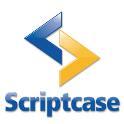

# SAE - Sistema de Assistência Estudantil 

> Sistema de apoio ao fornecimento de fardamentos e empréstimos de livros desenvolvido durante estágio no Depart. de Gestão de Tecnologia da Informação (DGTI) do IFPE campus Recife para a Diretoria de Assistência ao Estudante do mesmo campus.

## Necessidade

Os processos de fornecimento de livros didáticos e entrega de fardamento eram realizados via protocolo em papel, o que levava tempo para sua localização em arquivos físicos. Com objetivo de reduzir o volume de papeis gastos nestas operações, bem como organziar e proteger as transações realizadas, foi solicitado ao DGTI um sistema que otimizasse estes processos.

## Ferramentas utilizadas

Para elaborar este sistema foi utilizado o Scriptcase v8.0, ambiente de desenvolvimento focado em PHP. Como ferramentas auxiliares foram utilizados Visual Studio Code para manipulação e análise de arquivos HTML, Javascript e CSS, usados de forma auxiliar ao Scriptcase, além do Mozilla Firefox e Google Chrome para testes de compatibilidade entre navegadores.

## Consumo de API

## Funcionalidades

O sistema possibilita:

* Cadastrar pacientes (Aluno, Servidor, Terceirizado ou Visitante);
* Consultar pacientes;
* Atualizar dados dos pacientes;
* Cadastrar usuários (Recepcionista, Aux. de Enfermagem., Enfermeira, Aux. de Dentista, Dentista, Médico, Gestor);
* Consultar dados do usuários;
* Cadastrar atendimento realizado;
* Consultar atendimento;
* Preencher prontuário (Dados do paciente, Triagem, Evolução médica, Conduta médica, Evolução odontológica, Conduta odontológica, Prescrição médica/odontológica, Registro de enfermagem);
* Preencher odontograma (Status do dente e das faces, Histórico do paciente e  Anotações);
* Emitir documentos (Atestados, Receituário, Declaração, Ficha de acompanhamento, Licença para tratamento e Licença de acompanhamento familiar);
* Alterar e-mail e senha dos usuários.

## Agradecimentos

* Aos estagiários e colegas de equipe: Marcos Antonio Ferrreira da Silva Junior e Eduardo Pinto Feitosa da Silva Filho;
* Ao supervisor da equipe de Desenvolvimento, Victor Monte;
* Ao responsável pelo Depart. de Gestão de Tecnologia da Informação, Tárcio Luna;
* E a todos os funcionários da Diretoria de Assistência ao Estudante por colaborarem com a equipe de Desenvolvimento.
